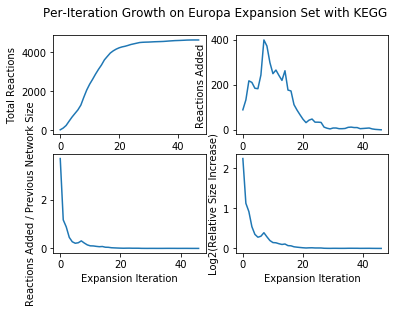
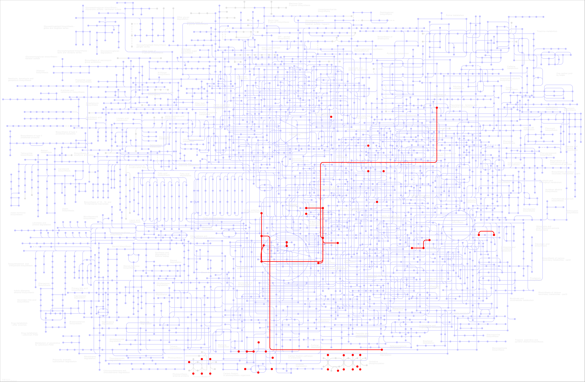

# Network Expansion Code Guide

<!-- Formatting: One sentence per line to make git diffing easier -->
## Running Network Expansion Code

This is a quick guide on how to use the network expansion code in this repository to explore the expansion of your own seed set.
We'll explore how to construct a metabolic network, establish constraints, and then run a network expansion.
The first step is to load in the networkExpansionPy library:
```python
import networkExpansionPy.lib as ne  # Expansion/graph code
```
With the library loaded in we can construct the graph, and perform a few pruning steps:
```python
# Construct network
metabolism = ne.GlobalMetabolicNetwork()
# Pruning steps:
# 1) Remove things with nonsense stoichiometries
# 2) Remove reactions that unrealistically produce new elements
# 3) Look at a pH of 7 (alterable but must be between 5 and 9, 0.5 increments)
# 4) Set Upper and lower metabolite bounds
# 6) Irreversible required for thermodynamic considerations
# 7) Remove infeasible reactions
metabolism.init_pruning()
```
There are a few steps here that must be executed in order:
- Pruning inconsistent and unbalanced reactions should be first, to speed up execution time
- You must set the pH and metabolite bounds before pruning thermodynamically infeasible reactions
- You also must convert reactions to irreversible to remove infeasible reactions (delta G is direction dependent in the pruning process)

Once this is set up, you have a few options for how to proceed.
One option that is often useful is to remove reactions that depend on oxygen.
This can be done as follows:
```python
metabolism.oxygen_independent()
```

Whether or not you choose to remove oxygen dependent reactions, the next step is to load in your seed set.
This is a set of chemicals that you speculate are initially present that we will grow the network from.
The seed set is stored in a comma separated file (.csv) as follows:
```
CID,Name
C00001,Water
C00011,Carbon dioxide
C00080,Hydrogen Ions
C00014,Ammonia
C00009,Phosphate
C00283,Hydrogen sulfide
C01328,HO-
```
The most important thing in this file is making sure that the compound identifier (CID) is correct, as this is what the code will use internally when looking for reactions.
If this file was called `seeds.csv`, we could load it in as follows (using a full filesystem path if necessary:)
```python
# Read in the sead compounds and parse them
cpds = pd.read_csv("seeds.csv")
# Normalize by removing whitespace, using pandas formatting
cpds["CID"] = cpds["CID"].apply(lambda x: x.strip())
seedset = set(cpds["CID"].tolist())
```
This code also does some formatting to remove any stray whitespace that might cause issues when looking up compound names.
Once we have this done, it's straightforward to run the actual network expansion:
```python
ne_cpds, ne_rxns, ne_cpds_list, ne_rxns_list = metabolism.expand(seedset)
```
This will return 4 variables:
- A list of compounds in the final expanded set
- A list of reactions in the final expanded set
- A list of lists of compounds at each step in the expansion
- A list of lists of reactions at each step in the expansion

Additionally a .txt file will be created of compound and reaction IDs.

These can then be used for later analysis and visualization.

## Visualization

###### Network Growth Over Time

<center></center>

Below is code to generate the above plot that displays the growth of the network over time.

```python
# Get the number of new compounds at each step
rxns_count_list = [len(x) for x in ne_rxns_list]
rxns_count_differences = list(
    np.array(rxns_count_list[1:]) - np.array(rxns_count_list[:-1])
)
rxns_count_stepratios = list(
    np.array(rxns_count_differences) / np.array(rxns_count_list[:-1])
)
rxns_count_logquots = list(
    np.log2(np.array(rxns_count_list[1:]) / np.array(rxns_count_list[:-1]))
)
# Plot the growth over time
fig, ax = plt.subplots(nrows=2, ncols=2)
fig.suptitle("Per-Iteration Growth on Minimal Expansion Set with KEGG")
ax[0, 0].plot(rxns_count_list)
ax[0, 0].set_xlabel("Expansion Iteration")
ax[0, 0].set_ylabel("Total Reactions")
ax[0, 1].plot(rxns_count_differences)
ax[0, 1].set_xlabel("Expansion Iteration")
ax[0, 1].set_ylabel("Reactions Added")
ax[1, 0].plot(rxns_count_stepratios)
ax[1, 0].set_xlabel("Expansion Iteration")
ax[1, 0].set_ylabel("Reactions Added / Previous Network Size")
ax[1, 1].plot(rxns_count_logquots)
ax[1, 1].set_xlabel("Expansion Iteration")
ax[1, 1].set_ylabel("Log2(Relative Size Increase)")
```

###### WebWeb Interactive Display

<center></center>

WebWeb [(developed by Dan Larrenmore)](https://webwebpage.github.io/) is an interactive network based package within which the resulting expanded network can be generated to explore the connectivity of reactions and importance of compounds. 

```python
# Read in data for name conversion
with open(
    "../networkExpansionPy/assets/iqbio/compounds.csv"
) as cpds_file_handle:
    lines = list(cpds_file_handle.readlines())
    cpd_dict = {
        cpd: name
        for cpd, name in [
            line.strip("cpd:").strip().split(maxsplit=1) for line in lines
        ]
    }
    
# Get dict of product/reactant pairs associated with each reaction
rxn_pairs, _ = pk.get_rxn_pairs()

# Convert reactions to compounds
edges = set()
# Look up every product/reactant pair for all reactions in current step
for rxn in ne_rxns:
    try:
        edges.update(rxn_pairs[rxn[0]])
    except KeyError:
        print(f"Reaction {rxn[0]} not found")
        
# Convert compounds to their real names (not CXXXXX)
edges_renamed = [(cpd_dict[x], cpd_dict[y]) for x, y in edges]
nodes_renamed = [cpd_dict[x] for x in ne_cpds]
nodes_dct = {nodes_renamed[i]: i for i in range(0, len(nodes_renamed))}

# Add a later to our webweb object
web = Web(adjacency=list(edges_renamed), nodes=nodes_dct, title='Metabolism Network: Europa')

# Generate the webweb object for interactive visualization
web.display.sizeBy = 'degree'
web.display.colorBy = 'degree'
web.show()
```

###### KEGG Mapper

<center></center>

The [KEGG database](https://www.genome.jp/kegg/pathway.html) also features a system for overlaying inputted reactions and compounds. To do so:
1) Naviagate to the [Metabolic Pathway visual](https://www.genome.jp/kegg-bin/show_pathway?161946480161614/map01100.args)
2) Click the '+' next to User Data on the left hand menu
3) Click 'Choose File' and select the outputted .txt file from your expansion 
4) (optional) Enter a dataset name
5) Click Exec to create your network overlaying the KEGG diagram

There are additonal pathway types to explore on the top left and reactions and compounds can be clicked on for identifcation. 
More detailed information on each reaction and compound in your network can be accessed through inputting your network in [KEGG Mapper](https://www.genome.jp/kegg/tool/map_pathway1.html)


##ATLAS Alternative Database
[ATLAS](https://lcsb-databases.epfl.ch/pathways/atlas/) is a database of potentially feasibly biological reactions developed by the [Laboratory of Computational Systems of Biotechnology](https://www.epfl.ch/labs/lcsb/).
An example file `expand_minimal_atlas.py` demonstrates how to run your network expanion using ATLAS instead of the default database.
Most notably the pruning steps must be skipped since the current version of the code relies on KEGG-specific reaction IDs. These steps may be skipped by the following:
```python
metabolism = ne.GlobalMetabolicNetwork(atlas)
metabolism.init_pruning(atlas)
```
Additionally, the correct connection between generated reactions and compound IDs generated from `parseATLAS.py` must be made which can be accomplished with the following:
```python
import networkExpansionPy.parseAtlas as pa

rxn_pairs, _ = pa.get_rxn_pairs()
```

`parseATLAS.py` also contains functions for parsing the raw ATLAS database files to generate an network output matching the format of the KEGG network. 

## Functional Test

To check for functionality of the example expansions included, run the following test:
```
bash expansion_functional_tests.sh
```
